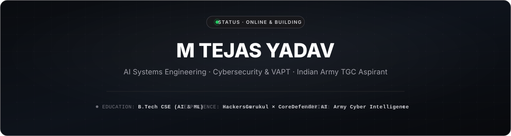

<div align="center">
  

  <br><br>

  <!-- Clean Monochrome Social Links (Pure Neutral #141414) -->
  <p align="center">
    <a href="https://mtejasyadav.vercel.app" target="_blank">
      
    </a>
    <a href="https://linkedin.com/in/tejassxo" target="_blank">
      
    </a>
    <a href="mailto:tejas.yadav3453@gmail.com">
      
    </a>
    <a href="https://discord.gg/tejassxo" target="_blank">
      
    </a>
  </p>
</div>

<br>

### Executive Overview

Pre-final year **Computer Science & Engineering (AI & ML)** student combining **offensive cybersecurity (VAPT & OSINT)** with **cloud-native AI systems engineering**. Actively conducting applied security research, developing real-time telemetry streaming platforms, and preparing for commissioning as a Cyber Intelligence Officer through the **Indian Army Technical Graduate Course (TGC)**.

---

### Industry Experience

<table>
  <tr>
    <td width="50%" valign="top">
      <h4>🛡️ HackersGurukul</h4>
      <p><b>Cybersecurity &amp; R&amp;D Intern</b></p>
      <ul>
        <li>Execute Vulnerability Assessment &amp; Penetration Testing (VAPT) across web and network targets.</li>
        <li>Conduct Open-Source Intelligence (OSINT) workflows, reconnaissance, and attack surface enumeration.</li>
        <li>Mentored under Prabhudas Thanneeru (CEO &amp; State Director, CRAI India).</li>
      </ul>
      <p><sub><code>Kali Linux</code> · <code>BurpSuite Pro</code> · <code>Nmap</code> · <code>OWASP Top 10</code> · <code>PTES</code></sub></p>
    </td>
    <td width="50%" valign="top">
      <h4>🤖 CoreDefender AI (US)</h4>
      <p><b>AI Systems Engineering Intern</b></p>
      <ul>
        <li>Engineered real-time telemetry streaming platform for medical and health-tech wearable devices.</li>
        <li>Built serverless data ingestion pipelines for biometric vectors (Heart Rate, SpO2).</li>
        <li>Deployed cloud-native frontend and edge services on AWS and React/TypeScript.</li>
      </ul>
      <p><sub><code>React</code> · <code>TypeScript</code> · <code>AWS Amplify</code> · <code>API Gateway</code> · <code>Cloud Telemetry</code></sub></p>
      <p><a href="https://main.d332sakcgle7gs.amplifyapp.com/"><b>Explore Live Platform →</b></a></p>
    </td>
  </tr>
</table>

---

### Flagship Projects

<table>
  <tr>
    <td width="50%" valign="top">
      <h4>🩺 CoreDefender AI Wearables</h4>
      <p>Production-grade health-tech platform for live wearable telemetry ingestion, real-time biometric analysis, and anomaly visualization.</p>
      <p>
        
        
        
      </p>
      <p><a href="https://main.d332sakcgle7gs.amplifyapp.com/"><b>Live Application →</b></a></p>
    </td>
    <td width="50%" valign="top">
      <h4>🛡️ ShieldScan Professional</h4>
      <p>Asynchronous network reconnaissance and port scanning utility featuring a clean PyQt5 interface, stealth packet delivery, and custom rate limiting.</p>
      <p>
        
        
        
      </p>
      <p><a href="https://github.com/tejassxo/Sheild-Scan"><b>Repository &amp; Architecture →</b></a></p>
    </td>
  </tr>
  <tr>
    <td width="50%" valign="top">
      <h4>🚨 CrimeIntel Master Repository</h4>
      <p>National Cyber Threat Assessment initiative tracking cybercrime patterns, attack vectors, and regional incident metrics across India (2020–2026).</p>
      <p>
        
        
        
      </p>
      <p><a href="https://github.com/tejassxo/CrimeIntel"><b>Repository &amp; Threat Data →</b></a></p>
    </td>
    <td width="50%" valign="top">
      <h4>🌐 Interactive 3D Portfolio</h4>
      <p>Flagship engineering portfolio with fluid motion choreography, live telemetry simulation, dynamic theme responsiveness, and WebGL elements.</p>
      <p>
        
        
        
      </p>
      <p><a href="https://mtejasyadav.vercel.app"><b>Launch Studio (mtejasyadav.vercel.app) →</b></a></p>
    </td>
  </tr>
</table>

<details>
<summary><b>View Additional Works &amp; Open Source</b></summary>
<br>

| Project | Description | Stack | Links |
| :--- | :--- | :--- | :--- |
| **Credentials Logger** | Enterprise credential issuance platform with CSV verification and validation engine | TypeScript · Firebase · Vercel | [Live Demo](https://credentials-logger.vercel.app) · [Code](https://github.com/tejassxo/Credentials-Logger) |
| **ClearDose** | Counterfeit drug mitigation and sustainable supply chain verification (SDG-12) | JavaScript · Blockchain · AI | [Live Demo](https://cleardose-tej.vercel.app) · [Code](https://github.com/tejassxo/cleardose) |
| **Eco-Route Navigation** | Multi-powertrain route emissions optimizer (Petrol, Diesel, EV, Bike) | TypeScript · OSRM · Gemini AI | [Live Demo](https://eco-route-navy.vercel.app) · [Code](https://github.com/tejassxo/Eco-Route) |
| **Vision AI Studio** | Interactive generative vision platform with inpainting &amp; canvas rendering | TypeScript · React · Gemini 2.5 | [Code](https://github.com/tejassxo/Vision-AI-Studio) |
| **AI Skill Hub** | Liquid-glassmorphic learning path portal built during R&amp;D internship | TypeScript · Three.js · GSAP | [Code](https://github.com/tejassxo/Ai-Skill-Hub) |

</details>

---

### Technical Arsenal

<table>
  <tr>
    <td width="28%"><b>Security &amp; VAPT</b></td>
    <td>Kali Linux, BurpSuite Pro, Nmap, Gobuster, theHarvester, Sherlock, Wireshark, Metasploit, OWASP Top 10, PTES Methodology</td>
  </tr>
  <tr>
    <td><b>Languages</b></td>
    <td>Python, TypeScript, JavaScript, C, Java, SQL, Bash</td>
  </tr>
  <tr>
    <td><b>Web &amp; Systems</b></td>
    <td>React.js, Next.js, Node.js, Tailwind CSS, Framer Motion, Three.js, REST APIs</td>
  </tr>
  <tr>
    <td><b>Cloud &amp; DevOps</b></td>
    <td>AWS (Amplify, Lambda, API Gateway), Vercel, Firebase, Git, Linux System Administration</td>
  </tr>
  <tr>
    <td><b>AI &amp; Data</b></td>
    <td>Google Gemini API, OpenCV, Machine Learning Pipelines, Pandas, NumPy</td>
  </tr>
</table>

<br>

<p align="center">
  
  
  
  
  
  
  
</p>

---

### 🖥️ Systems & Defense Console

```text
┌── [ tejassxo@workstation ] ────────────────────────────────────────────────────────┐
│                                                                                    │
│   OPERATIONAL PROFILE                                                              │
│   ├── Target       : Indian Army TGC (Cyber Intelligence & Corps of Signals)       │
│   ├── Discipline   : Computer Science & Engineering (AI & Machine Learning)        │
│   ├── Mission      : Serve as a Commissioned Cyber Intelligence Officer            │
│   │                                                                                │
│   APPLIED LABS & INDUSTRY                                                          │
│   ├── HackersGurukul    -> Vulnerability Assessment, OSINT & Network Pentesting    │
│   └── CoreDefender AI   -> Real-time Health Telemetry Streaming (React / AWS)      │
│                                                                                    │
│   ARSENAL & METHODOLOGIES                                                          │
│   ├── Offensive Sec     -> BurpSuite Pro · Kali Linux · Nmap · OWASP Top 10 · PTES │
│   ├── Cloud & Infra     -> AWS Amplify · REST APIs · Serverless Ingestion · SQL    │
│   └── Software Eng      -> Python · TypeScript · React · Next.js · Node.js         │
│                                                                                    │
└────────────────────────────────────────────────────────────── [ STATUS: ARMED ] ──┘
```

---

<div align="center">
  <sub>Engineering resilient systems today for the defense intelligence of tomorrow. 🇮🇳</sub>
</div>
