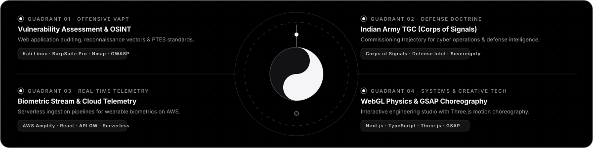
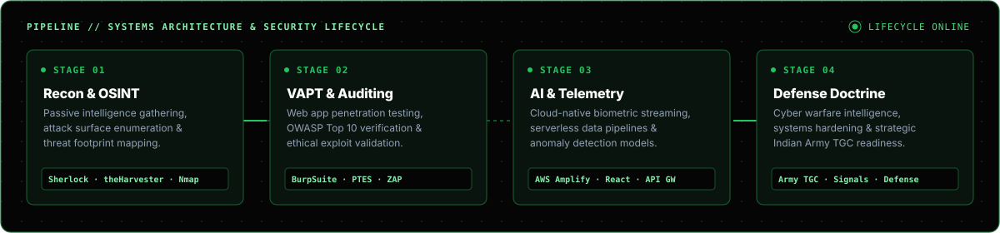

<div align="center">
  

  <br><br>

  <!-- Apple Minimal Dynamic Typing -->
  <a href="https://github.com/tejassxo">
    
  </a>

  <br><br>

  <!-- Apple Bento Quick Comms Grid -->
  <p align="center">
    <a href="https://mtejasyadav.vercel.app" target="_blank">
      
    </a>
    <a href="https://linkedin.com/in/tejassxo" target="_blank">
      
    </a>
    <a href="mailto:tejas.yadav3453@gmail.com">
      
    </a>
    <a href="https://discord.gg/tejassxo" target="_blank">
      
    </a>
    <a href="https://github.com/tejassxo">
      
    </a>
    <a href="https://github.com/tejassxo">
      
    </a>
  </p>
</div>

<br>

### Operational Profile // Executive Directive

<table>
  <tr>
    <td width="50%" valign="top">
      <h4>01 // Defense Trajectory &amp; Commissioning</h4>
      <p><b>Indian Army Technical Graduate Course (TGC)</b></p>
      <ul>
        <li><b>Target Branch:</b> Corps of Signals / Defence Cyber Agency (DCA)</li>
        <li><b>Discipline:</b> Pre-Final Year B.Tech CSE (AI &amp; Machine Learning)</li>
        <li><b>Doctrine:</b> Duty, Integrity, Continuous Technical Supremacy</li>
      </ul>
      <p><sub><code>Signals Intelligence</code> · <code>Cyber Defense</code> · <code>Systems Hardening</code></sub></p>
    </td>
    <td width="50%" valign="top">
      <h4>02 // Offensive Security &amp; VAPT</h4>
      <p><b>Applied Adversarial Research &amp; Penetration Testing</b></p>
      <ul>
        <li><b>Methodology:</b> PTES Standards &amp; OWASP Top 10 Verification</li>
        <li><b>Specialization:</b> Web &amp; Network Vulnerability Assessment</li>
        <li><b>Reconnaissance:</b> OSINT Footprinting &amp; Threat Surface Mapping</li>
      </ul>
      <p><sub><code>Kali Linux</code> · <code>BurpSuite Pro</code> · <code>Nmap</code> · <code>Wireshark</code></sub></p>
    </td>
  </tr>
  <tr>
    <td width="50%" valign="top">
      <h4>03 // Cloud-Native AI &amp; Telemetry</h4>
      <p><b>Serverless Biometrics &amp; Edge Ingestion</b></p>
      <ul>
        <li><b>Core System:</b> Real-time Health Telemetry Streaming (US Wearables)</li>
        <li><b>Infrastructure:</b> AWS Amplify, API Gateway &amp; Serverless Lambdas</li>
        <li><b>Biometric Vectors:</b> Live Heart Rate, SpO2, HRV &amp; Anomaly Detection</li>
      </ul>
      <p><sub><code>React</code> · <code>TypeScript</code> · <code>AWS Serverless</code> · <code>Cloud Telemetry</code></sub></p>
    </td>
    <td width="50%" valign="top">
      <h4>04 // Systems Architecture &amp; Creative Tech</h4>
      <p><b>Full-Stack Engineering &amp; Motion Choreography</b></p>
      <ul>
        <li><b>Creative Tech:</b> Three.js (WebGL), GSAP Physics, Fluid Animations</li>
        <li><b>Enterprise Web:</b> Next.js, React.js, Tailwind CSS, TypeScript</li>
        <li><b>Architecture:</b> RESTful APIs, Event-Driven Ingestion, PostgreSQL</li>
      </ul>
      <p><sub><code>Next.js</code> · <code>Three.js</code> · <code>GSAP</code> · <code>TypeScript</code> · <code>PostgreSQL</code></sub></p>
    </td>
  </tr>
</table>

---

### Zen Defense Command HUD

<div align="center">
  
</div>

---

### Industry Appointments &amp; Research Labs

<table>
  <tr>
    <td width="50%" valign="top">
      <h4>HackersGurukul</h4>
      <p><b>Cybersecurity &amp; R&amp;D Intern</b> · <code>[ VAPT &amp; OSINT SCOPE ]</code></p>
      <br>
      <table>
        <tr><td width="28%"><b>Scope</b></td><td>Web Applications, Network Infrastructure &amp; Recon</td></tr>
        <tr><td><b>Mentorship</b></td><td>Prabhudas Thanneeru (CEO &amp; State Director, CRAI India)</td></tr>
        <tr><td><b>Deliverables</b></td><td>VAPT Audits, Threat Surface Mapping, PTES Reports</td></tr>
        <tr><td><b>Arsenal</b></td><td>Kali Linux · BurpSuite Pro · Nmap · OWASP Top 10</td></tr>
      </table>
      <br>
      <p>
        
        
        
        
      </p>
    </td>
    <td width="50%" valign="top">
      <h4>CoreDefender AI (US)</h4>
      <p><b>AI Systems Engineering Intern</b> · <code>[ CLOUD TELEMETRY &amp; EDGE SCOPE ]</code></p>
      <br>
      <table>
        <tr><td width="28%"><b>Platform</b></td><td>Production Real-time Wearable Health Telemetry Engine</td></tr>
        <tr><td><b>Pipelines</b></td><td>Serverless Ingestion for Heart Rate &amp; SpO2 Vectors</td></tr>
        <tr><td><b>Frontend</b></td><td>Reactive Edge Visualization Dashboard in React / TS</td></tr>
        <tr><td><b>Cloud</b></td><td>AWS Amplify · API Gateway · Lambda Serverless</td></tr>
      </table>
      <br>
      <p>
        
        
        
        
      </p>
      <p><a href="https://main.d332sakcgle7gs.amplifyapp.com/"><b>Explore Live Platform &rarr;</b></a></p>
    </td>
  </tr>
</table>

---

### Systems Lifecycle &amp; Security Pipeline

<div align="center">
  
</div>

---

### Flagship Engineering Platforms

<table>
  <tr>
    <td width="50%" valign="top">
      <h4>CoreDefender AI Wearables</h4>
      <p><sub><b>STATUS:</b> PRODUCTION &nbsp;|&nbsp; <b>CATEGORY:</b> HEALTH-TECH TELEMETRY</sub></p>
      <p>Production-grade health-tech platform for live wearable telemetry ingestion, real-time biometric analysis, and anomaly visualization.</p>
      <table>
        <tr><td width="30%"><b>Architecture</b></td><td>AWS Serverless Telemetry Pipeline</td></tr>
        <tr><td><b>Key Metric</b></td><td>Low-latency stream for live biometric data</td></tr>
        <tr><td><b>Core Stack</b></td><td>React · TypeScript · AWS Amplify · API GW</td></tr>
      </table>
      <br>
      <p>
        
        
        
      </p>
      <p><a href="https://main.d332sakcgle7gs.amplifyapp.com/"><b>Launch Live Application &rarr;</b></a></p>
    </td>
    <td width="50%" valign="top">
      <h4>ShieldScan Professional</h4>
      <p><sub><b>STATUS:</b> OPERATIONAL UTILITY &nbsp;|&nbsp; <b>CATEGORY:</b> NETWORK SECURITY</sub></p>
      <p>High-throughput asynchronous network reconnaissance and port scanning utility featuring stealth packet delivery, custom rate limiting, and multithreaded architecture.</p>
      <table>
        <tr><td width="30%"><b>Architecture</b></td><td>Async Multi-Threaded Packet Engine</td></tr>
        <tr><td><b>Key Metric</b></td><td>Custom Rate Limiting &amp; Stealth Scans</td></tr>
        <tr><td><b>Core Stack</b></td><td>Python · PyQt5 · Scapy · VAPT Engine</td></tr>
      </table>
      <br>
      <p>
        
        
        
      </p>
      <p><a href="https://github.com/tejassxo/Sheild-Scan"><b>Repository &amp; Architecture &rarr;</b></a></p>
    </td>
  </tr>
  <tr>
    <td width="50%" valign="top">
      <h4>CrimeIntel Master Repository</h4>
      <p><sub><b>STATUS:</b> THREAT INTEL INITIATIVE &nbsp;|&nbsp; <b>CATEGORY:</b> OSINT &amp; DATA</sub></p>
      <p>National Cyber Threat Assessment initiative tracking cybercrime patterns, attack vectors, and regional incident metrics across India (2020–2026).</p>
      <table>
        <tr><td width="30%"><b>Architecture</b></td><td>Incident Classification &amp; Temporal Modeling</td></tr>
        <tr><td><b>Key Metric</b></td><td>6-Year Longitudinal Cybercrime Mapping</td></tr>
        <tr><td><b>Core Stack</b></td><td>Cyber Threat Intel · OSINT · Data Modeling</td></tr>
      </table>
      <br>
      <p>
        
        
        
      </p>
      <p><a href="https://github.com/tejassxo/CrimeIntel"><b>Repository &amp; Threat Data &rarr;</b></a></p>
    </td>
    <td width="50%" valign="top">
      <h4>Interactive 3D Portfolio</h4>
      <p><sub><b>STATUS:</b> LIVE STUDIO &nbsp;|&nbsp; <b>CATEGORY:</b> CREATIVE ENGINEERING</sub></p>
      <p>Flagship engineering portfolio with fluid motion choreography, live telemetry simulation, dynamic theme responsiveness, and WebGL elements.</p>
      <table>
        <tr><td width="30%"><b>Architecture</b></td><td>Hardware-Accelerated WebGL Scene Graph</td></tr>
        <tr><td><b>Key Metric</b></td><td>Fluid Motion Choreography &amp; GSAP Easing</td></tr>
        <tr><td><b>Core Stack</b></td><td>Next.js · TypeScript · Three.js · GSAP</td></tr>
      </table>
      <br>
      <p>
        
        
        
        
      </p>
      <p><a href="https://mtejasyadav.vercel.app"><b>Launch Studio (mtejasyadav.vercel.app) &rarr;</b></a></p>
    </td>
  </tr>
</table>

<details>
<summary><b>Declassified Secondary Projects &amp; Open Source Specifications</b></summary>
<br>

| Project | Domain &amp; Architecture | Engineering Stack | Access Point |
| :--- | :--- | :--- | :--- |
| **Credentials Logger** | Enterprise credential issuance platform with CSV verification &amp; validation engine | TypeScript · Firebase · Vercel | [Live Demo](https://credentials-logger.vercel.app) · [Code](https://github.com/tejassxo/Credentials-Logger) |
| **ClearDose** | Counterfeit pharmaceutical mitigation and sustainable supply chain verification (SDG-12) | JavaScript · Blockchain · AI | [Live Demo](https://cleardose-tej.vercel.app) · [Code](https://github.com/tejassxo/cleardose) |
| **Eco-Route Navigation** | Multi-powertrain route emissions optimizer (Petrol, Diesel, EV, Bike) with graph routing | TypeScript · OSRM · Gemini AI | [Live Demo](https://eco-route-navy.vercel.app) · [Code](https://github.com/tejassxo/Eco-Route) |
| **Vision AI Studio** | Generative vision studio with inpainting, segmentation, and interactive canvas tools | TypeScript · React · Gemini 2.5 | [Code](https://github.com/tejassxo/Vision-AI-Studio) |
| **AI Skill Hub** | Liquid-glassmorphic learning path portal built during applied R&amp;D internship | TypeScript · Three.js · GSAP | [Code](https://github.com/tejassxo/Ai-Skill-Hub) |

</details>

---

### Technical Arsenal &amp; Capability Matrix

<div align="center">
  
</div>

<br>

<table>
  <tr>
    <th width="24%">Domain</th>
    <th width="38%">Tools &amp; Frameworks</th>
    <th width="38%">Methodologies &amp; Standards</th>
  </tr>
  <tr>
    <td><b>Offensive VAPT &amp; OSINT</b></td>
    <td>Kali Linux, BurpSuite Pro, Nmap, Gobuster, Sherlock, theHarvester, Wireshark, Metasploit</td>
    <td>OWASP Top 10, PTES Methodology, Threat Modeling, Attack Surface Enumeration</td>
  </tr>
  <tr>
    <td><b>Languages &amp; Core Systems</b></td>
    <td>Python, TypeScript, JavaScript, C, Java, SQL, Bash Scripting</td>
    <td>Object-Oriented Design, Asynchronous Programming, Data Structures &amp; Algorithms</td>
  </tr>
  <tr>
    <td><b>Web, WebGL &amp; Motion</b></td>
    <td>React.js, Next.js, Node.js, Tailwind CSS, Framer Motion, Three.js, GSAP</td>
    <td>Component Architecture, Responsive Layouts, WebGL Shaders, Motion Choreography</td>
  </tr>
  <tr>
    <td><b>Cloud &amp; Distributed Systems</b></td>
    <td>AWS (Amplify, Lambda, API Gateway), Vercel, Firebase, Git, Linux Admin</td>
    <td>Serverless Ingestion, CI/CD Workflows, Edge Computing, IoT Telemetry Architecture</td>
  </tr>
  <tr>
    <td><b>AI Systems &amp; Telemetry</b></td>
    <td>Google Gemini API, OpenCV, Pandas, NumPy, Machine Learning Pipelines</td>
    <td>Biometric Telemetry Ingestion, Anomaly Detection, Generative AI Integration</td>
  </tr>
</table>

---

### Telemetry &amp; System Intelligence

<div align="center">
  
  
</div>

---

### Workstation Diagnostic &amp; Command HUD

```text
┌── [ tejassxo@workstation ] ────────────────────────────────────────────────────────┐
│                                                                                    │
│   OPERATIONAL DIRECTIVE                                                            │
│   ├── Target       : Indian Army Technical Graduate Course (TGC)                   │
│   ├── Commission   : Officer in the Corps of Signals / Defence Cyber Agency        │
│   ├── Discipline   : B.Tech Computer Science & Engineering (AI & ML)               │
│   │                                                                                │
│   APPLIED RESEARCH & LABS                                                          │
│   ├── HackersGurukul     -> Offensive VAPT, OSINT & Surface Mapping (CRAI)         │
│   └── CoreDefender AI    -> Real-Time Wearable Telemetry Ingestion (AWS Cloud)     │
│                                                                                    │
│   ARSENAL & METHODOLOGIES                                                          │
│   ├── Offensive Sec      -> BurpSuite Pro · Kali Linux · Nmap · OWASP Top 10 · PTES│
│   ├── Cloud Infrastructure -> AWS Amplify · API Gateway · Serverless Lambdas · SQL │
│   └── Systems & Motion   -> Python · TypeScript · React · Next.js · Three.js · GSAP│
│                                                                                    │
└────────────────────────────────────────────────────────── [ STATUS: OPERATIONAL ] ─┘
```

---

<div align="center">
  <sub><code>[ TRANSMISSION TERMINATED // SECURE LINE // LEVEL-01 VERIFIED ]</code></sub><br>
  <sub>Architecting sovereign cyber intelligence systems for defense and critical infrastructure.</sub>
</div>
